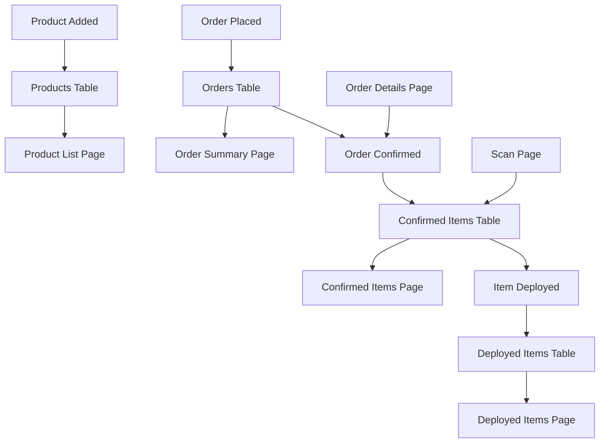
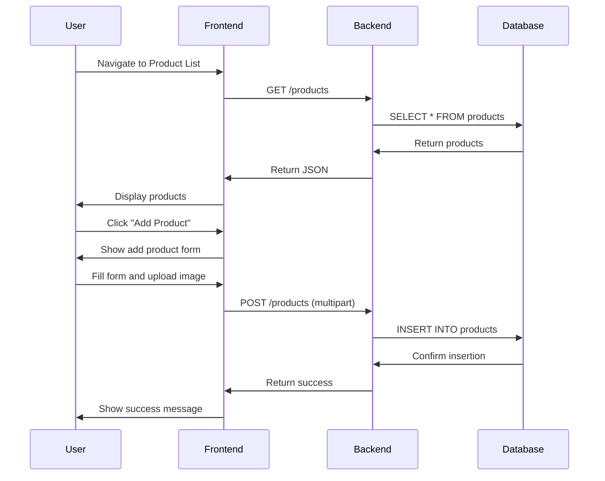
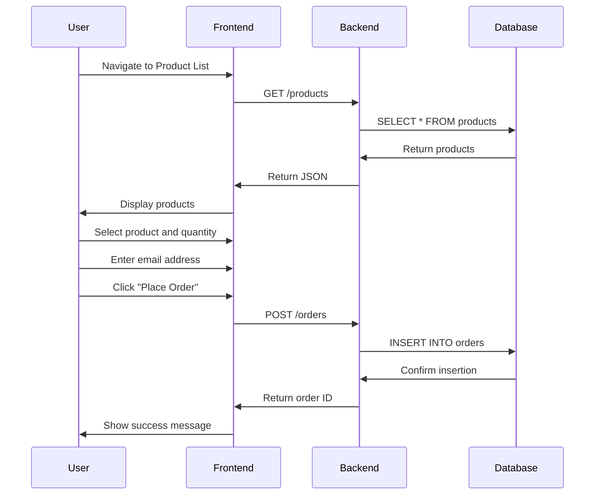
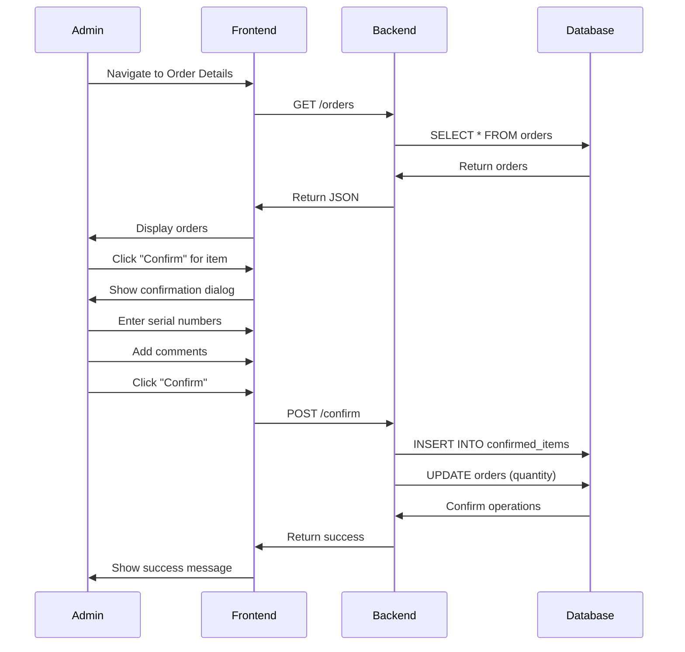
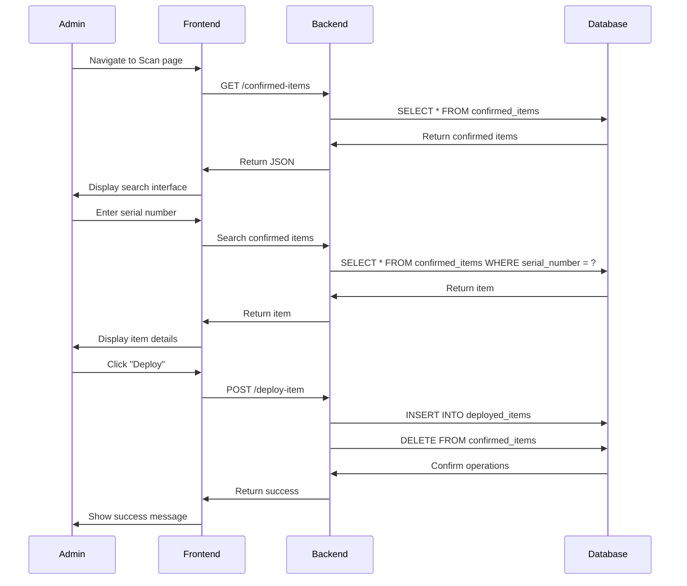

# Order Management System - Complete Documentation

## Table of Contents
1. [System Overview](#system-overview)
2. [Architecture](#architecture)
3. [Database Design](#database-design)
4. [API Documentation](#api-documentation)
5. [Frontend Components](#frontend-components)
6. [User Workflows](#user-workflows)
7. [Installation & Setup](#installation--setup)
8. [Configuration](#configuration)
9. [Deployment](#deployment)
10. [Troubleshooting](#troubleshooting)

---

## System Overview

The Order Management System is a full-stack web application designed to manage IT equipment orders, confirmations, and deployments. It provides a comprehensive solution for tracking products from initial order placement through confirmation to final deployment.

### Key Features
- **Product Management**: Add, edit, and manage IT equipment inventory
- **Order Processing**: Place orders with email validation and quantity tracking
- **Order Confirmation**: Confirm orders with serial number assignment
- **Item Deployment**: Deploy confirmed items with tracking
- **Advanced Search**: Filter and search across all data
- **Export Functionality**: CSV export for reporting
- **Responsive Design**: Works on desktop and mobile devices

### Technology Stack
- **Frontend**: React.js with Material-UI
- **Backend**: Node.js with Express.js
- **Database**: MySQL
- **File Storage**: Local file system for images
- **Process Management**: PM2

---

## Architecture

```
┌─────────────────┐    ┌─────────────────┐    ┌─────────────────┐
│   Frontend      │    │    Backend      │    │    Database     │
│   (React)       │◄──►│   (Node.js)     │◄──►│    (MySQL)      │
│                 │    │                 │    │                 │
│ - ProductList   │    │ - REST API      │    │ - products      │
│ - OrderSummary  │    │ - File Upload   │    │ - orders        │
│ - OrderDetails  │    │ - Image Storage │    │ - confirmed_items│
│ - ConfirmedItems│    │ - Data Processing│    │ - deployed_items│
│ - DeployedItems │    │                 │    │                 │
│ - Scan          │    │                 │    │                 │
└─────────────────┘    └─────────────────┘    └─────────────────┘
```

### Data Flow
1. **Order Creation**: User places order → Frontend → Backend → Database
2. **Order Confirmation**: Admin confirms order → Updates quantities and serial numbers
3. **Item Deployment**: Admin deploys item → Moves from confirmed to deployed
4. **Data Retrieval**: Frontend requests data → Backend queries database → Returns JSON

---

## Database Design

### Entity Relationship Diagram

```mermaid
erDiagram
    PRODUCTS {
        int id PK
        varchar product_name
        text description
        decimal price
        varchar image
        datetime created_at
        datetime updated_at
    }
    
    ORDERS {
        int id PK
        int product_id FK
        int quantity
        varchar ordered_by
        datetime order_date
        int order_id
        text comment
        datetime created_at
        datetime updated_at
    }
    
    CONFIRMED_ITEMS {
        int id PK
        int order_id FK
        int product_id FK
        varchar product_name
        int quantity
        varchar serial_number
        varchar ordered_by
        datetime order_date
        datetime confirm_date
        text item_comment
        text comment
        varchar image
        datetime created_at
        datetime updated_at
    }
    
    DEPLOYED_ITEMS {
        int id PK
        int order_id FK
        int product_id FK
        varchar product_name
        varchar serial_number
        varchar ordered_by
        datetime order_date
        datetime confirm_date
        datetime deploy_date
        text item_comment
        varchar image
        datetime created_at
        datetime updated_at
    }

    PRODUCTS ||--o{ ORDERS : "has"
    ORDERS ||--o{ CONFIRMED_ITEMS : "becomes"
    CONFIRMED_ITEMS ||--o{ DEPLOYED_ITEMS : "deployed_as"
```



### Database Schema

#### Products Table
```sql
CREATE TABLE products (
    id INT PRIMARY KEY AUTO_INCREMENT,
    product_name VARCHAR(255) NOT NULL,
    description TEXT,
    price DECIMAL(10,2),
    image VARCHAR(255),
    created_at TIMESTAMP DEFAULT CURRENT_TIMESTAMP,
    updated_at TIMESTAMP DEFAULT CURRENT_TIMESTAMP ON UPDATE CURRENT_TIMESTAMP
);
```

#### Orders Table
```sql
CREATE TABLE orders (
    id INT PRIMARY KEY AUTO_INCREMENT,
    product_id INT NOT NULL,
    quantity INT NOT NULL,
    ordered_by VARCHAR(255) NOT NULL,
    order_date DATETIME NOT NULL,
    order_id INT NOT NULL,
    comment TEXT,
    created_at TIMESTAMP DEFAULT CURRENT_TIMESTAMP,
    updated_at TIMESTAMP DEFAULT CURRENT_TIMESTAMP ON UPDATE CURRENT_TIMESTAMP,
    FOREIGN KEY (product_id) REFERENCES products(id)
);
```

#### Confirmed Items Table
```sql
CREATE TABLE confirmed_items (
    id INT PRIMARY KEY AUTO_INCREMENT,
    order_id INT NOT NULL,
    product_id INT NOT NULL,
    product_name VARCHAR(255) NOT NULL,
    quantity INT NOT NULL,
    serial_number VARCHAR(255),
    ordered_by VARCHAR(255) NOT NULL,
    order_date DATETIME NOT NULL,
    confirm_date DATETIME NOT NULL,
    item_comment TEXT,
    comment TEXT,
    image VARCHAR(255),
    created_at TIMESTAMP DEFAULT CURRENT_TIMESTAMP,
    updated_at TIMESTAMP DEFAULT CURRENT_TIMESTAMP ON UPDATE CURRENT_TIMESTAMP,
    FOREIGN KEY (order_id) REFERENCES orders(id),
    FOREIGN KEY (product_id) REFERENCES products(id)
);
```

#### Deployed Items Table
```sql
CREATE TABLE deployed_items (
    id INT PRIMARY KEY AUTO_INCREMENT,
    order_id INT NOT NULL,
    product_id INT NOT NULL,
    product_name VARCHAR(255) NOT NULL,
    serial_number VARCHAR(255) NOT NULL,
    ordered_by VARCHAR(255) NOT NULL,
    order_date DATETIME NOT NULL,
    confirm_date DATETIME NOT NULL,
    deploy_date DATETIME NOT NULL,
    item_comment TEXT,
    image VARCHAR(255),
    created_at TIMESTAMP DEFAULT CURRENT_TIMESTAMP,
    updated_at TIMESTAMP DEFAULT CURRENT_TIMESTAMP ON UPDATE CURRENT_TIMESTAMP,
    FOREIGN KEY (order_id) REFERENCES orders(id),
    FOREIGN KEY (product_id) REFERENCES products(id)
);
```

### Data Flow Diagram



---

## API Documentation

### Base URL
```
http://localhost:3007
```

### Endpoints

#### Products
- **GET** `/products` - Get all products
- **POST** `/products` - Add new product
- **PUT** `/products/:id` - Update product
- **DELETE** `/products/:id` - Delete product

#### Orders
- **GET** `/orders` - Get all orders
- **POST** `/orders` - Place new order
- **POST** `/bulk-orders` - Place multiple orders
- **PUT** `/update-order-id` - Update order ID

#### Confirmed Items
- **GET** `/confirmed-items` - Get all confirmed items
- **POST** `/confirm` - Confirm an order
- **PUT** `/update-comment` - Update item comment

#### Deployed Items
- **GET** `/deployed-items` - Get all deployed items
- **POST** `/deploy-item` - Deploy an item
- **POST** `/undeploy-item` - Undeploy an item

### Request/Response Examples

#### Add Product
```javascript
POST /products
Content-Type: multipart/form-data

{
  "product_name": "ThinkPad X1 Carbon",
  "description": "14-inch business laptop",
  "price": 1299.99,
  "image": [file]
}

Response:
{
  "success": true,
  "message": "Product added successfully",
  "product": {
    "id": 1,
    "product_name": "ThinkPad X1 Carbon",
    "image": "/images/1723053669508.jpg"
  }
}
```

#### Place Order
```javascript
POST /orders
Content-Type: application/json

{
  "product_id": 1,
  "quantity": 5,
  "ordered_by": "john.doe@company.com"
}

Response:
{
  "success": true,
  "message": "Order placed successfully",
  "order_id": 123
}
```

#### Confirm Order
```javascript
POST /confirm
Content-Type: application/json

{
  "order_id": 123,
  "product_id": 1,
  "serial_numbers": ["SN001", "SN002", "SN003"],
  "comment": "All items received in good condition"
}

Response:
{
  "success": true,
  "message": "Order confirmed successfully"
}
```

---

## Frontend Components

### Component Architecture

```
App.js
├── ProductList.js
├── OrderSummary.js
├── OrderDetails.js
├── ConfirmedItems.js
├── DeployedItems.js
└── Scan.js
```

### Key Components

#### ProductList.js
- **Purpose**: Manage product inventory and place orders
- **Features**:
  - Add new products with image upload
  - Edit existing products
  - Place orders with quantity and email
  - Search and filter products
  - Column visibility controls
  - Export functionality

#### OrderSummary.js
- **Purpose**: View open orders
- **Features**:
  - Display all pending orders
  - Search by product, person, or order ID
  - Date range filtering
  - Export orders to CSV

#### OrderDetails.js
- **Purpose**: Confirm orders and assign serial numbers
- **Features**:
  - Group orders by order ID
  - Confirm individual items
  - Add/edit item comments
  - Serial number assignment
  - Bulk confirmation

#### ConfirmedItems.js
- **Purpose**: View and manage confirmed items
- **Features**:
  - Accordion-style order grouping
  - Category totals (Monitors, Notebooks, Accessories)
  - Advanced search and filtering
  - Clickable rows for item details
  - Export functionality
  - Refresh capability

#### DeployedItems.js
- **Purpose**: View and manage deployed items
- **Features**:
  - Accordion-style order grouping
  - Item deployment tracking
  - Undeploy functionality
  - Clickable rows for item details
  - Export functionality
  - Refresh capability

#### Scan.js
- **Purpose**: Deploy items via serial number scanning
- **Features**:
  - Serial number input
  - Item validation
  - Deployment confirmation
  - Item details display
  - Search functionality

### State Management
- **Local State**: Each component manages its own state using React hooks
- **Data Fetching**: Components fetch data from API endpoints
- **Real-time Updates**: Refresh buttons for immediate data updates
- **Error Handling**: Comprehensive error states and user feedback

---

## User Workflows

### 1. Product Management Workflow


### 2. Order Processing Workflow


### 3. Order Confirmation Workflow


### 4. Item Deployment Workflow


---

## Installation & Setup

### Prerequisites
- Node.js (v14 or higher)
- MySQL (v8.0 or higher)
- PM2 (for production)

### Backend Setup

1. **Clone Repository**
```bash
git clone https://github.com/BFurkan/Order-Management.git
cd Order-Management/backend
```

2. **Install Dependencies**
```bash
npm install
```

3. **Database Setup**
```bash
# Create database
mysql -u root -p
CREATE DATABASE order_management;
USE order_management;

# Run migration
mysql -u root -p order_management < migrate.sql
```

4. **Environment Configuration**
```bash
cp env.example .env
# Edit .env with your database credentials
```

5. **Start Server**
```bash
# Development
npm start

# Production
pm2 start server.js --name order-backend
```

### Frontend Setup

1. **Navigate to Frontend**
```bash
cd ../frontend
```

2. **Install Dependencies**
```bash
npm install
```

3. **Environment Configuration**
```bash
cp env.example .env
# Edit .env if needed
```

4. **Start Development Server**
```bash
npm start
```

---

## Configuration

### Backend Configuration (.env)
```env
# Database Configuration
DB_HOST=localhost
DB_USER=root
DB_PASSWORD=your_password
DB_NAME=order_management
DB_PORT=3306

# Server Configuration
PORT=3004
NODE_ENV=production

# File Upload Configuration
UPLOAD_PATH=./public/images
MAX_FILE_SIZE=5242880
```

### Frontend Configuration
- API Base URL: `http://10.167.49.200:3004`
- Image Base URL: `http://10.167.49.200:3004/images`

### PM2 Configuration
```json
{
  "apps": [
    {
      "name": "order-backend",
      "script": "server.js",
      "cwd": "./backend",
      "env": {
        "NODE_ENV": "production",
        "PORT": 3004
      }
    },
    {
      "name": "order-frontend",
      "script": "npm",
      "args": "start",
      "cwd": "./frontend",
      "env": {
        "NODE_ENV": "production",
        "PORT": 3003
      }
    }
  ]
}
```

---

## Deployment

### Production Deployment Steps

1. **Server Preparation**
```bash
# Update system
sudo apt update && sudo apt upgrade -y

# Install Node.js
curl -fsSL https://deb.nodesource.com/setup_18.x | sudo -E bash -
sudo apt-get install -y nodejs

# Install PM2
sudo npm install -g pm2

# Install MySQL
sudo apt install mysql-server -y
```

2. **Application Deployment**
```bash
# Clone repository
git clone https://github.com/BFurkan/Order-Management.git
cd Order-Management

# Setup backend
cd backend
npm install
cp env.example .env
# Edit .env with production settings

# Setup frontend
cd ../frontend
npm install
cp env.example .env
```

3. **Database Setup**
```bash
# Create database and user
mysql -u root -p
CREATE DATABASE order_management;
CREATE USER 'order_user'@'localhost' IDENTIFIED BY 'secure_password';
GRANT ALL PRIVILEGES ON order_management.* TO 'order_user'@'localhost';
FLUSH PRIVILEGES;

# Run migrations
mysql -u order_user -p order_management < backend/migrate.sql
```

4. **Start Services**
```bash
# Start backend
cd backend
pm2 start server.js --name order-backend

# Start frontend
cd ../frontend
pm2 start npm --name order-frontend -- start

# Save PM2 configuration
pm2 save
pm2 startup
```

### Nginx Configuration (Optional)
```nginx
server {
    listen 80;
    server_name your-domain.com;

    location / {
        proxy_pass http://localhost:3003;
        proxy_http_version 1.1;
        proxy_set_header Upgrade $http_upgrade;
        proxy_set_header Connection 'upgrade';
        proxy_set_header Host $host;
        proxy_cache_bypass $http_upgrade;
    }

    location /api {
        proxy_pass http://localhost:3004;
        proxy_http_version 1.1;
        proxy_set_header Upgrade $http_upgrade;
        proxy_set_header Connection 'upgrade';
        proxy_set_header Host $host;
        proxy_cache_bypass $http_upgrade;
    }
}
```

---

## Troubleshooting

### Common Issues

#### 1. Database Connection Issues
**Problem**: Cannot connect to MySQL
**Solution**:
```bash
# Check MySQL service
sudo systemctl status mysql

# Restart MySQL
sudo systemctl restart mysql

# Check credentials in .env file
# Verify database exists
mysql -u root -p -e "SHOW DATABASES;"
```

#### 2. Port Already in Use
**Problem**: Port 3004 or 3003 is already in use
**Solution**:
```bash
# Find process using port
sudo lsof -i :3004

# Kill process
sudo kill -9 <PID>

# Or change port in .env file
```

#### 3. Image Upload Issues
**Problem**: Images not uploading or displaying
**Solution**:
```bash
# Check upload directory permissions
sudo chmod 755 backend/public/images

# Check disk space
df -h

# Verify file size limits in server.js
```

#### 4. PM2 Issues
**Problem**: PM2 processes not starting
**Solution**:
```bash
# Check PM2 status
pm2 status

# Restart all processes
pm2 restart all

# Check logs
pm2 logs

# Delete and recreate processes
pm2 delete all
pm2 start ecosystem.config.js
```

### Performance Optimization

#### Database Optimization
```sql
-- Add indexes for better performance
CREATE INDEX idx_orders_order_id ON orders(order_id);
CREATE INDEX idx_confirmed_items_serial ON confirmed_items(serial_number);
CREATE INDEX idx_deployed_items_serial ON deployed_items(serial_number);
CREATE INDEX idx_orders_date ON orders(order_date);
```

#### Application Optimization
- Enable gzip compression
- Implement caching for static assets
- Use CDN for images in production
- Implement database connection pooling

### Security Considerations

1. **Input Validation**: All user inputs are validated
2. **SQL Injection Prevention**: Using parameterized queries
3. **File Upload Security**: File type and size validation
4. **CORS Configuration**: Proper CORS settings for production
5. **Environment Variables**: Sensitive data stored in .env files

### Monitoring

#### PM2 Monitoring
```bash
# Monitor processes
pm2 monit

# View logs
pm2 logs

# Monitor resources
pm2 status
```

#### Database Monitoring
```sql
-- Check table sizes
SELECT 
    table_name,
    ROUND(((data_length + index_length) / 1024 / 1024), 2) AS 'Size (MB)'
FROM information_schema.tables 
WHERE table_schema = 'order_management';
```

---

## Maintenance

### Regular Tasks

1. **Database Backup**
```bash
# Daily backup script
mysqldump -u order_user -p order_management > backup_$(date +%Y%m%d).sql
```

2. **Log Rotation**
```bash
# Configure logrotate for PM2 logs
sudo nano /etc/logrotate.d/pm2
```

3. **System Updates**
```bash
# Update system packages
sudo apt update && sudo apt upgrade -y

# Update Node.js dependencies
npm update
```

### Backup and Recovery

#### Backup Strategy
- **Daily**: Database backup
- **Weekly**: Full application backup
- **Monthly**: System configuration backup

#### Recovery Procedures
1. Restore database from backup
2. Restart application services
3. Verify data integrity
4. Test functionality

---

## Support

### Contact Information
- **Repository**: https://github.com/BFurkan/Order-Management
- **Issues**: Use GitHub Issues for bug reports
- **Documentation**: This file and related docs in `/docs` folder

### Contributing
1. Fork the repository
2. Create a feature branch
3. Make changes
4. Test thoroughly
5. Submit pull request

---

*Last Updated: January 2025*
*Version: 1.0.0* 