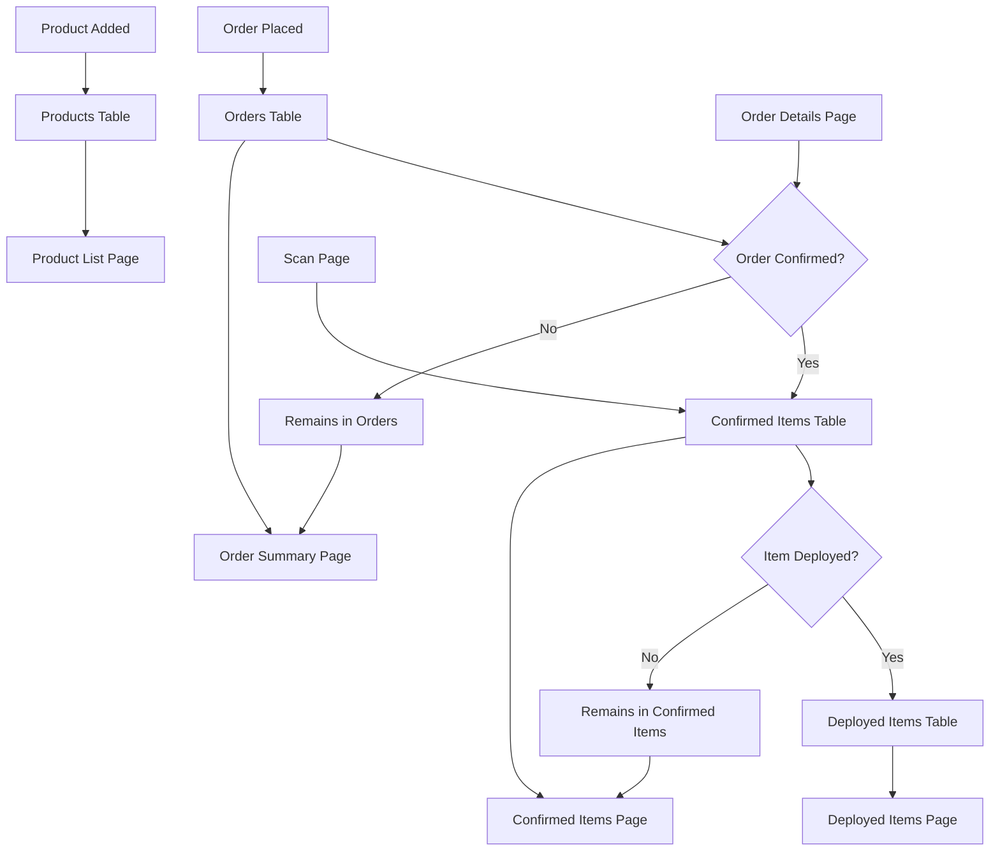

# Database Structure & Relationships

## Entity Relationship Diagram

```mermaid
erDiagram
    %% Products Entity
    PRODUCTS {
        int id PK "Auto Increment"
        varchar product_name "Product Name"
        text description "Product Description"
        decimal price "Product Price"
        varchar image "Image Path"
        datetime created_at "Creation Timestamp"
        datetime updated_at "Last Update"
    }
    
    %% Orders Entity
    ORDERS {
        int id PK "Auto Increment"
        int product_id FK "References Products"
        int quantity "Order Quantity"
        varchar ordered_by "Email Address"
        datetime order_date "Order Date"
        int order_id "Group Order ID"
        text comment "Order Comment"
        datetime created_at "Creation Timestamp"
        datetime updated_at "Last Update"
    }
    
    %% Confirmed Items Entity
    CONFIRMED_ITEMS {
        int id PK "Auto Increment"
        int order_id FK "References Orders"
        int product_id FK "References Products"
        varchar product_name "Product Name (Denormalized)"
        int quantity "Confirmed Quantity"
        varchar serial_number "Serial Number"
        varchar ordered_by "Email Address"
        datetime order_date "Original Order Date"
        datetime confirm_date "Confirmation Date"
        text item_comment "Item-specific Comment"
        text comment "Order-level Comment"
        varchar image "Image Path"
        datetime created_at "Creation Timestamp"
        datetime updated_at "Last Update"
    }
    
    %% Deployed Items Entity
    DEPLOYED_ITEMS {
        int id PK "Auto Increment"
        int order_id FK "References Orders"
        int product_id FK "References Products"
        varchar product_name "Product Name (Denormalized)"
        varchar serial_number "Serial Number"
        varchar ordered_by "Email Address"
        datetime order_date "Original Order Date"
        datetime confirm_date "Confirmation Date"
        datetime deploy_date "Deployment Date"
        text item_comment "Item Comment"
        varchar image "Image Path"
        datetime created_at "Creation Timestamp"
        datetime updated_at "Last Update"
    }

    %% Relationships
    PRODUCTS ||--o{ ORDERS : "has"
    ORDERS ||--o{ CONFIRMED_ITEMS : "becomes"
    CONFIRMED_ITEMS ||--o{ DEPLOYED_ITEMS : "deployed_as"
```



## Database Schema Details

### 1. Products Table
**Purpose**: Stores product catalog information

| Column | Type | Constraints | Description |
|--------|------|-------------|-------------|
| `id` | INT | PRIMARY KEY, AUTO_INCREMENT | Unique product identifier |
| `product_name` | VARCHAR(255) | NOT NULL | Product name |
| `description` | TEXT | NULL | Product description |
| `price` | DECIMAL(10,2) | NULL | Product price |
| `image` | VARCHAR(255) | NULL | Image file path |
| `created_at` | TIMESTAMP | DEFAULT CURRENT_TIMESTAMP | Creation timestamp |
| `updated_at` | TIMESTAMP | DEFAULT CURRENT_TIMESTAMP ON UPDATE | Last update timestamp |

**Sample Data**:
```sql
INSERT INTO products (product_name, description, price, image) VALUES
('ThinkPad X1 Carbon', '14-inch business laptop', 1299.99, '/images/thinkpad.jpg'),
('ThinkVision T32p-20', '32-inch 4K monitor', 899.99, '/images/monitor.jpg'),
('ThinkPad Docking Station', 'USB-C docking station', 299.99, '/images/dock.jpg');
```

### 2. Orders Table
**Purpose**: Stores initial order information

| Column | Type | Constraints | Description |
|--------|------|-------------|-------------|
| `id` | INT | PRIMARY KEY, AUTO_INCREMENT | Unique order identifier |
| `product_id` | INT | NOT NULL, FOREIGN KEY | References products.id |
| `quantity` | INT | NOT NULL | Order quantity |
| `ordered_by` | VARCHAR(255) | NOT NULL | Email address of requester |
| `order_date` | DATETIME | NOT NULL | Order placement date |
| `order_id` | INT | NOT NULL | Group order identifier |
| `comment` | TEXT | NULL | Order-level comment |
| `created_at` | TIMESTAMP | DEFAULT CURRENT_TIMESTAMP | Creation timestamp |
| `updated_at` | TIMESTAMP | DEFAULT CURRENT_TIMESTAMP ON UPDATE | Last update timestamp |

**Sample Data**:
```sql
INSERT INTO orders (product_id, quantity, ordered_by, order_date, order_id, comment) VALUES
(1, 5, 'john.doe@company.com', '2025-01-15 10:30:00', 123, 'For new employees'),
(2, 3, 'jane.smith@company.com', '2025-01-15 11:00:00', 124, 'Replacement monitors');
```

### 3. Confirmed Items Table
**Purpose**: Stores confirmed orders with serial numbers

| Column | Type | Constraints | Description |
|--------|------|-------------|-------------|
| `id` | INT | PRIMARY KEY, AUTO_INCREMENT | Unique confirmed item identifier |
| `order_id` | INT | NOT NULL, FOREIGN KEY | References orders.id |
| `product_id` | INT | NOT NULL, FOREIGN KEY | References products.id |
| `product_name` | VARCHAR(255) | NOT NULL | Denormalized product name |
| `quantity` | INT | NOT NULL | Confirmed quantity |
| `serial_number` | VARCHAR(255) | NULL | Assigned serial number |
| `ordered_by` | VARCHAR(255) | NOT NULL | Email address |
| `order_date` | DATETIME | NOT NULL | Original order date |
| `confirm_date` | DATETIME | NOT NULL | Confirmation date |
| `item_comment` | TEXT | NULL | Item-specific comment |
| `comment` | TEXT | NULL | Order-level comment |
| `image` | VARCHAR(255) | NULL | Product image path |
| `created_at` | TIMESTAMP | DEFAULT CURRENT_TIMESTAMP | Creation timestamp |
| `updated_at` | TIMESTAMP | DEFAULT CURRENT_TIMESTAMP ON UPDATE | Last update timestamp |

**Sample Data**:
```sql
INSERT INTO confirmed_items (order_id, product_id, product_name, quantity, serial_number, ordered_by, order_date, confirm_date, item_comment) VALUES
(1, 1, 'ThinkPad X1 Carbon', 1, 'SN001234', 'john.doe@company.com', '2025-01-15 10:30:00', '2025-01-16 14:20:00', 'Ready for deployment'),
(1, 1, 'ThinkPad X1 Carbon', 1, 'SN001235', 'john.doe@company.com', '2025-01-15 10:30:00', '2025-01-16 14:20:00', 'Ready for deployment');
```

### 4. Deployed Items Table
**Purpose**: Stores deployed items with deployment tracking

| Column | Type | Constraints | Description |
|--------|------|-------------|-------------|
| `id` | INT | PRIMARY KEY, AUTO_INCREMENT | Unique deployed item identifier |
| `order_id` | INT | NOT NULL, FOREIGN KEY | References orders.id |
| `product_id` | INT | NOT NULL, FOREIGN KEY | References products.id |
| `product_name` | VARCHAR(255) | NOT NULL | Denormalized product name |
| `serial_number` | VARCHAR(255) | NOT NULL | Serial number |
| `ordered_by` | VARCHAR(255) | NOT NULL | Email address |
| `order_date` | DATETIME | NOT NULL | Original order date |
| `confirm_date` | DATETIME | NOT NULL | Confirmation date |
| `deploy_date` | DATETIME | NOT NULL | Deployment date |
| `item_comment` | TEXT | NULL | Item comment |
| `image` | VARCHAR(255) | NULL | Product image path |
| `created_at` | TIMESTAMP | DEFAULT CURRENT_TIMESTAMP | Creation timestamp |
| `updated_at` | TIMESTAMP | DEFAULT CURRENT_TIMESTAMP ON UPDATE | Last update timestamp |

**Sample Data**:
```sql
INSERT INTO deployed_items (order_id, product_id, product_name, serial_number, ordered_by, order_date, confirm_date, deploy_date, item_comment) VALUES
(1, 1, 'ThinkPad X1 Carbon', 'SN001234', 'john.doe@company.com', '2025-01-15 10:30:00', '2025-01-16 14:20:00', '2025-01-17 09:15:00', 'Deployed to John Doe'),
(1, 1, 'ThinkPad X1 Carbon', 'SN001235', 'john.doe@company.com', '2025-01-15 10:30:00', '2025-01-16 14:20:00', '2025-01-17 10:30:00', 'Deployed to Jane Smith');
```

## Data Flow Diagram



## Key Relationships

### 1. Product → Orders (One-to-Many)
- One product can have multiple orders
- Each order must reference a valid product
- Foreign key constraint ensures data integrity

### 2. Order → Confirmed Items (One-to-Many)
- One order can result in multiple confirmed items
- Each confirmed item references the original order
- Quantity from order is distributed across confirmed items

### 3. Confirmed Item → Deployed Item (One-to-One)
- Each confirmed item can be deployed once
- Deployed items are moved from confirmed items table
- Serial number is preserved through the process

## Indexes for Performance

```sql
-- Primary indexes (automatically created)
PRIMARY KEY on id columns

-- Foreign key indexes
CREATE INDEX idx_orders_product_id ON orders(product_id);
CREATE INDEX idx_confirmed_items_order_id ON confirmed_items(order_id);
CREATE INDEX idx_confirmed_items_product_id ON confirmed_items(product_id);
CREATE INDEX idx_deployed_items_order_id ON deployed_items(order_id);
CREATE INDEX idx_deployed_items_product_id ON deployed_items(product_id);

-- Search indexes
CREATE INDEX idx_orders_order_id ON orders(order_id);
CREATE INDEX idx_orders_ordered_by ON orders(ordered_by);
CREATE INDEX idx_confirmed_items_serial ON confirmed_items(serial_number);
CREATE INDEX idx_deployed_items_serial ON deployed_items(serial_number);

-- Date indexes
CREATE INDEX idx_orders_date ON orders(order_date);
CREATE INDEX idx_confirmed_items_confirm_date ON confirmed_items(confirm_date);
CREATE INDEX idx_deployed_items_deploy_date ON deployed_items(deploy_date);
```

## Data Integrity Constraints

### Foreign Key Constraints
```sql
-- Orders table
ALTER TABLE orders ADD CONSTRAINT fk_orders_product 
FOREIGN KEY (product_id) REFERENCES products(id) ON DELETE RESTRICT;

-- Confirmed Items table
ALTER TABLE confirmed_items ADD CONSTRAINT fk_confirmed_orders 
FOREIGN KEY (order_id) REFERENCES orders(id) ON DELETE CASCADE;
ALTER TABLE confirmed_items ADD CONSTRAINT fk_confirmed_products 
FOREIGN KEY (product_id) REFERENCES products(id) ON DELETE RESTRICT;

-- Deployed Items table
ALTER TABLE deployed_items ADD CONSTRAINT fk_deployed_orders 
FOREIGN KEY (order_id) REFERENCES orders(id) ON DELETE CASCADE;
ALTER TABLE deployed_items ADD CONSTRAINT fk_deployed_products 
FOREIGN KEY (product_id) REFERENCES products(id) ON DELETE RESTRICT;
```

### Check Constraints
```sql
-- Ensure positive quantities
ALTER TABLE orders ADD CONSTRAINT chk_orders_quantity CHECK (quantity > 0);
ALTER TABLE confirmed_items ADD CONSTRAINT chk_confirmed_quantity CHECK (quantity > 0);

-- Ensure valid email format (basic)
ALTER TABLE orders ADD CONSTRAINT chk_orders_email CHECK (ordered_by LIKE '%@%');
ALTER TABLE confirmed_items ADD CONSTRAINT chk_confirmed_email CHECK (ordered_by LIKE '%@%');
ALTER TABLE deployed_items ADD CONSTRAINT chk_deployed_email CHECK (ordered_by LIKE '%@%');
```

## Backup and Recovery

### Backup Script
```bash
#!/bin/bash
# backup_database.sh

DATE=$(date +%Y%m%d_%H%M%S)
BACKUP_DIR="/backups/order_management"
DB_NAME="order_management"
DB_USER="order_user"

# Create backup directory
mkdir -p $BACKUP_DIR

# Create database backup
mysqldump -u $DB_USER -p $DB_NAME > $BACKUP_DIR/backup_$DATE.sql

# Compress backup
gzip $BACKUP_DIR/backup_$DATE.sql

# Keep only last 30 days of backups
find $BACKUP_DIR -name "backup_*.sql.gz" -mtime +30 -delete

echo "Backup completed: backup_$DATE.sql.gz"
```

### Recovery Script
```bash
#!/bin/bash
# restore_database.sh

BACKUP_FILE=$1
DB_NAME="order_management"
DB_USER="order_user"

if [ -z "$BACKUP_FILE" ]; then
    echo "Usage: $0 <backup_file>"
    exit 1
fi

# Decompress and restore
gunzip -c $BACKUP_FILE | mysql -u $DB_USER -p $DB_NAME

echo "Database restored from $BACKUP_FILE"
```

## Monitoring Queries

### Table Sizes
```sql
SELECT 
    table_name,
    ROUND(((data_length + index_length) / 1024 / 1024), 2) AS 'Size (MB)',
    table_rows AS 'Row Count'
FROM information_schema.tables 
WHERE table_schema = 'order_management'
ORDER BY (data_length + index_length) DESC;
```

### Recent Activity
```sql
-- Recent orders
SELECT 
    p.product_name,
    o.quantity,
    o.ordered_by,
    o.order_date
FROM orders o
JOIN products p ON o.product_id = p.id
WHERE o.order_date >= DATE_SUB(NOW(), INTERVAL 7 DAY)
ORDER BY o.order_date DESC;

-- Recent deployments
SELECT 
    product_name,
    serial_number,
    ordered_by,
    deploy_date
FROM deployed_items
WHERE deploy_date >= DATE_SUB(NOW(), INTERVAL 7 DAY)
ORDER BY deploy_date DESC;
```

### Data Quality Checks
```sql
-- Orphaned records
SELECT 'Orders without products' as issue, COUNT(*) as count
FROM orders o
LEFT JOIN products p ON o.product_id = p.id
WHERE p.id IS NULL

UNION ALL

SELECT 'Confirmed items without orders' as issue, COUNT(*) as count
FROM confirmed_items ci
LEFT JOIN orders o ON ci.order_id = o.id
WHERE o.id IS NULL

UNION ALL

SELECT 'Deployed items without orders' as issue, COUNT(*) as count
FROM deployed_items di
LEFT JOIN orders o ON di.order_id = o.id
WHERE o.id IS NULL;
``` 